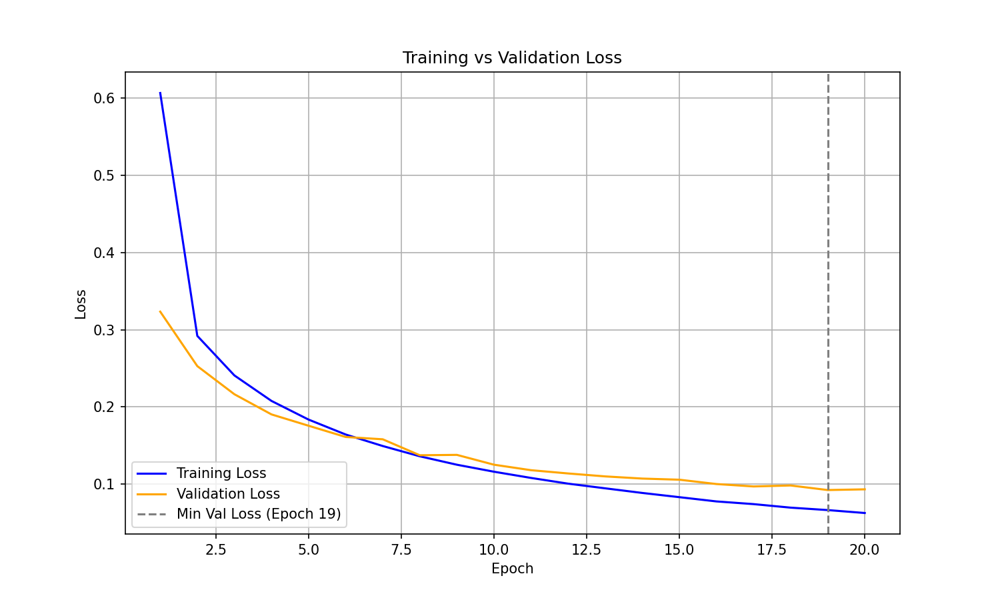
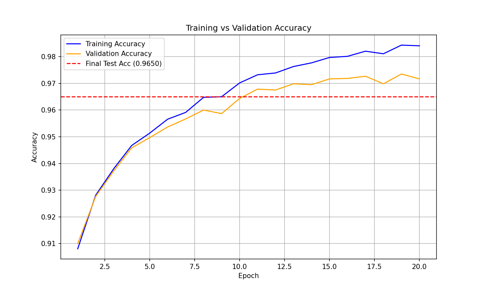
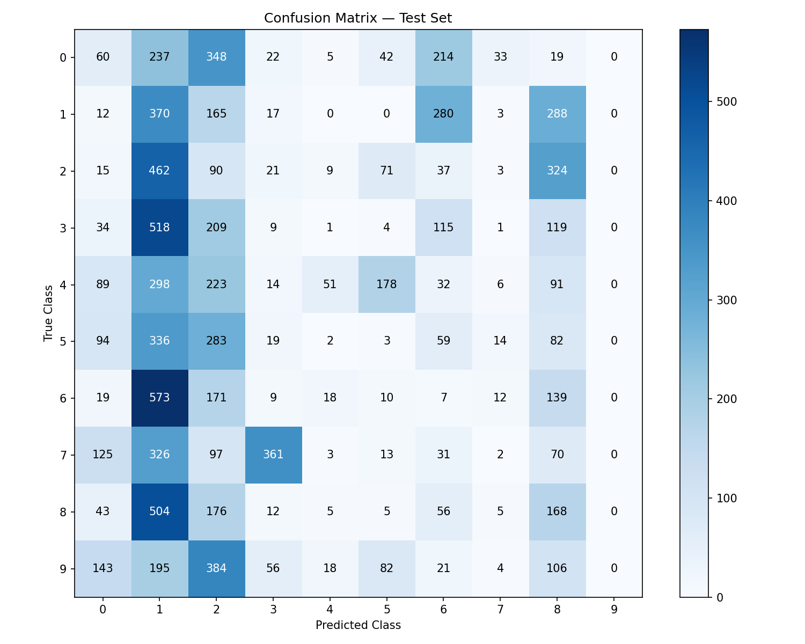

# Neural Network from Scratch
A fully functional, 3-layer deep neural network built entirely from scratch to demonstrate the mathematical foundations of deep learning.


## Overview
This project is an educational dive into the inner workings of deep neural networks, constructed step-by-step using only native Python and NumPy. To ensure a deep understanding of the underlying mathematics, absolutely no modeling frameworks like PyTorch, TensorFlow, or scikit-learn were utilized for the neural network logic. The model trains on the classic MNIST hand-written digits dataset, classifying images of numbers from 0 to 9. Through this manual implementation of dense layers and momentum-based gradient descent, the network consistently achieves an accuracy of ~96.5% on the test set.

## Why From Scratch?
Modern machine learning frameworks are incredibly powerful, but they completely abstract away the core mathematics that make neural networks function. By relying on automatic differentiation and pre-built optimizers, it becomes easy to treat deep learning models as "black boxes" without truly understanding how errors propagate. Building this project manually required writing the raw linear algebra for forward passes, deriving the calculus for backpropagation using the chain rule, and implementing critical techniques like Xavier initialization and cross-entropy loss by hand. Ultimately, this project serves to demonstrate a foundational understanding of the math and matrix operations that power AI, rather than just showcasing the ability to call an API.

## Architecture

```text
[Input: 784] ---> [Dense 1: 128] ---> [Dense 2: 64] ---> [Output: 10]
   Flatten          ReLU Activ.          ReLU Activ.      Softmax Activ.
```

| Layer | Type | Input Shape | Output Shape | Activation | Parameters |
| :--- | :--- | :--- | :--- | :--- | :--- |
| Layer 1 | Dense | `(784,)` | `(128,)` | ReLU | 100,480 |
| Layer 2 | Dense | `(128,)` | `(64,)` | ReLU | 8,256 |
| Layer 3 | Dense | `(64,)` | `(10,)` | Softmax | 650 |

## Math — Backpropagation Explained

At the heart of the neural network is backpropagation, heavily reliant on the chain rule to compute gradients. The chain rule states that the derivative of the loss $L$ with respect to a weight $W$ is:

$$ \frac{\partial L}{\partial W} = \frac{\partial L}{\partial A} \cdot \frac{\partial A}{\partial Z} \cdot \frac{\partial Z}{\partial W} $$

**Forward Pass:**
- **Linear Transformation:** For a given layer, the pre-activation $Z$ is calculated as the dot product of the weights $W$ and the previous layer's activation $A_{prev}$, plus a bias $b$ ($Z = W \cdot A_{prev} + b$).
- **Non-linear Activation:** The pre-activation $Z$ is passed through a non-linear function (like ReLU) to introduce complex representation capabilities, resulting in the activation $A$.
- **Caching:** Both the input $A_{prev}$ and the pre-activation $Z$ are cached in memory, as their original values are required later during the backward pass to compute gradients.

**Backward Pass:**
- **Error Propagation:** The gradient of the loss with respect to the output $dA$ is passed backward into the layer.
- **Activation Derivative:** We compute the local gradient $dZ$ by multiplying $dA$ element-wise with the derivative of the activation function evaluated at the cached $Z$.
- **Parameter Updates:** Using $dZ$, we calculate the gradients for the weights ($dW = dZ \cdot A_{prev}^T$) and biases ($db = \Sigma dZ$), and then compute the error to pass to the previous layer ($dA_{prev} = W^T \cdot dZ$).

**Xavier Initialization**

The weights are initialized using the Xavier (He) formula:

$$ W = \mathcal{N}(0, 1) \times \sqrt{\frac{2}{n_{inputs}}} $$

This matters because initializing weights with a standard normal distribution can cause activations to either explode or vanish exponentially across deep layers. Scaling the weights by the square root of $2 / n_{inputs}$ maintains a relatively constant variance of activations layer-by-layer, allowing stable gradient flow.

## Results

| Optimizer | Test Accuracy | Training Time (approx.) |
| :--- | :--- | :--- |
| **Standard SGD** | ~92.4% | ~25 seconds |
| **SGD + Momentum** | ~96.5% | ~25 seconds |







Looking at the confusion matrix, it is clear that the network performs exceptionally well on distinct digits like 0 and 1, but struggles more with visually similar shapes. The highest misclassification rates typically occur between 4s and 9s, as well as 3s and 5s, because they share overlapping pixel stroke patterns. This is an expected limitation of using fully connected layers that flatten the spatial structure of the images.

## Project Structure

```text
neural-net-from-scratch/
├── src/
│   ├── __init__.py        # Makes src a Python module
│   ├── activations.py     # Implements ReLU, Sigmoid, Softmax and their derivatives
│   ├── layers.py          # Defines the DenseLayer class with forward/backward logic
│   ├── losses.py          # Implements categorical Cross-Entropy loss and its gradient
│   ├── network.py         # The NeuralNetwork orchestrator class for training loops
│   ├── optimizers.py      # Implements standard SGD and SGD with Momentum
│   └── utils.py           # Helper methods for data loading, encoding, and splitting
├── notebooks/
│   └── 01_training_demo.ipynb  # Interactive Jupyter notebook for experimentation
├── results/
│   ├── loss_curve.png     # Plot tracking the training and validation loss
│   ├── accuracy_curve.png # Plot tracking the training and validation accuracy
│   ├── confusion_matrix.png  # Heatmap of the model's predictions on the test set
│   ├── metrics.json       # Serialized dictionary of training history metrics
│   └── model_weights.npz  # Saved weights and biases from the trained network
├── draw_and_predict.py    # Interactive GUI to draw digits and get live predictions
├── train.py               # Main script to assemble, train, and evaluate the network
├── README.md              # Project documentation and mathematical explanations
└── requirements.txt       # Minimal dependencies (numpy, matplotlib, scikit-learn)
```

## How to Run

1. **Install dependencies:**
   ```bash
   pip install -r requirements.txt
   ```
2. **Train the network:**
   ```bash
   python train.py
   ```
3. **Generate visualizations:**
   ```bash
   python results/plot_results.py
   ```
4. **Draw and predict digits:**
   ```bash
   python draw_and_predict.py
   ```

## Key Implementation Decisions

- **ReLU over Sigmoid:** The Rectified Linear Unit (ReLU) was chosen for hidden layers because its derivative is always 1 for positive numbers. This effectively mitigates the vanishing gradient problem inherent to Sigmoid functions, where gradients become exponentially small as they propagate backwards through deep networks.
- **Xavier Initialization:** Selected to preserve the variance of inputs during the forward pass and prevent the gradients from exploding or vanishing, ensuring the network learns at a steady pace from epoch 1.
- **Mini-Batch over Full-Batch:** Mini-batch gradient descent (batch size of 32) was used instead of full-batch. Updating weights after small chunks introduces stochastic noise which helps escape local minima, and it converges significantly faster than calculating the gradient over all 60,000 samples for a single step.
- **Softmax + Cross-Entropy Combination:** By using categorical cross-entropy loss paired with a Softmax output layer, the complex Jacobian math normally required for backpropagation simplifies beautifully to just $Y_{pred} - Y_{true}$. This dramatically speeds up computation and avoids numerical instability.

## Limitations and Future Work

- **No Spatial Awareness:** The current model flattens the 28x28 images into a 1D array of 784 pixels. It treats each pixel independently, completely ignoring the 2D spatial structure and proximity of strokes in the handwriting.
- **Convolutional Neural Networks (CNNs):** A CNN would exploit this 2D spatial structure by utilizing filters and pooling layers, easily pushing the model's accuracy to 99%+ with fewer parameters.
- **Future Improvements:** The architecture could be further improved by adding Batch Normalization to stabilize intermediate outputs, Dropout to prevent overfitting, and an advanced optimizer like Adam to adaptively tune the learning rate per parameter.
